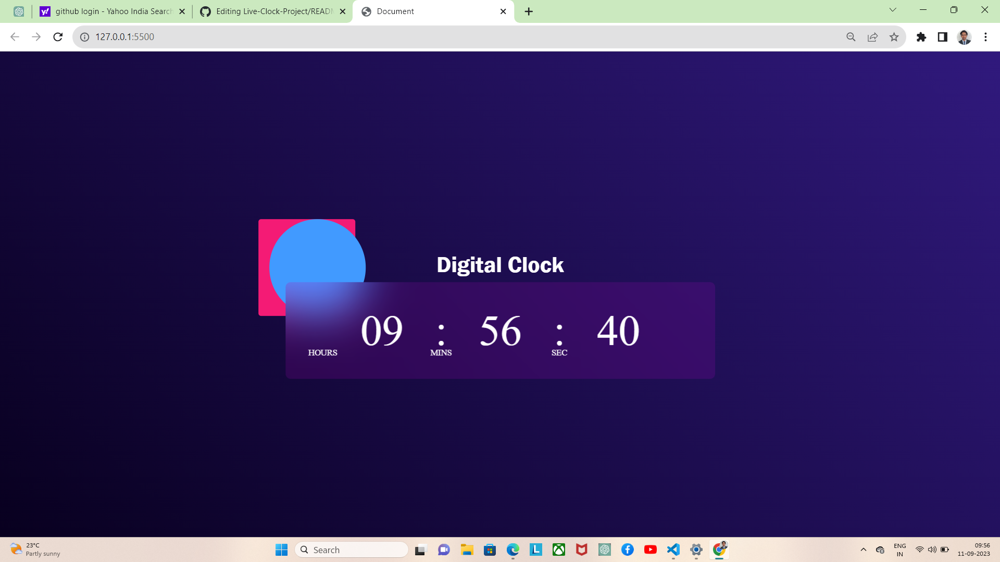

# Live-Clock-Project
A simple project to display a live clock on a web page using HTML, JavaScript, and CSS.

## Table of Contents

- [Description](#description)
- [Features](#features)
- [Usage](#usage)
- [Contributing](#contributing)
- [License](#license)

## Description

This project demonstrates how to create a live clock that updates every second to display the current time in hours, minutes, and seconds. It's a basic example of using JavaScript to manipulate the DOM and update the content dynamically.

## Features

- Real-time clock display.
- Automatic formatting of hours, minutes, and seconds with leading zeros.
